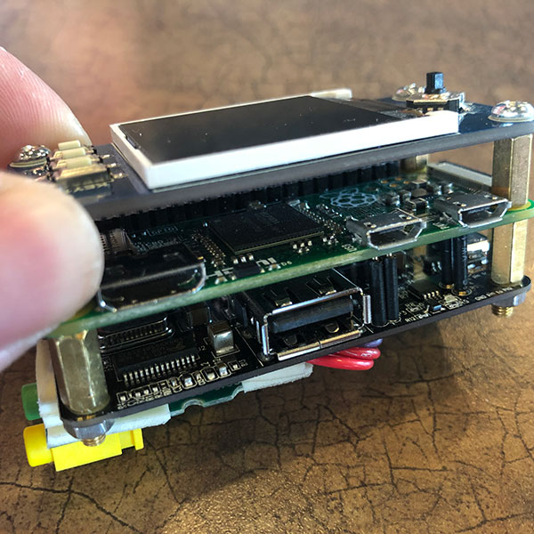
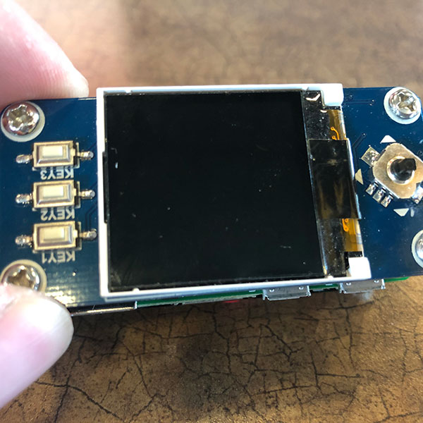

# OP1Kenobi
A full featured Companion for the Teenage Engineering OP1 Keyboard written in Python 2.7

While I adore my OP1, there are some things I would love to augment a bit to improve the workflow, plus more features = more better. 

## Video walkthrough of the hardware build
Coming Soon...

### Current developement progress:

| Progress        | Description           
| ------------- |:-------------:
| 80% | Setup hardware |
| Done! | Setup Linux environment |
| 90% | Complete v1.0, MVP features |
| 90% | Put together github for everything. |
| 0% | Put together tutorial video on initial build, initial code, key learnings and demonstration. |
| 0% | Complete V2.0, Expand feature set to less essential features |
| 0% | 3d printable case |

The linux distro is typical raspbian lite. Upon booting it automatically runs the python script. The usb soundcard has been soldered directly to one of the usb ports on the usb hub and set as the default for the os and the controls + display auto start on boot as well. You'll notice that I used a Raspberry Pi Zero instead of a Zero W. This was because I wanted to be able to omit the wifi adapter when I didn't need wifi ( easier on the battery, primarily. ) You could totally sub in a Zero W instead and have wireless connectivity all the time.

The hardware consists of:
1. A Raspberry Pi Zero [Amazon Link](https://www.amazon.com/Raspberry-Zero-v1-3-Development-Board/dp/B01L3IU6XS/ref=sr_1_10?keywords=raspberry+pi+zero&qid=1561653799&s=gateway&sr=8-10)
2. Screen + Controls 'hat' [Amazon Link](https://www.amazon.com/gp/product/B077Z7DWW1/ref=ppx_yo_dt_b_asin_image_o00_s00?ie=UTF8&psc=1)
3. 4 Port USB Hub [Amazon Link](https://www.amazon.com/gp/product/B01IT1TLFQ/ref=ppx_yo_dt_b_asin_image_o00_s00?ie=UTF8&psc=1)
4. USB Soundcard [Amazon Link](https://www.amazon.com/external-Adapter-Windows-Microphone-SD-CM-UAUD/dp/B001MSS6CS/ref=sr_1_31?keywords=usb+soundcard&qid=1561652789&s=gateway&sr=8-31)
5. LIPO Battery Charge controller [TBD]
6. LIPO Battery [TBD]
7. LIPO BATTERY 5v Boost Convertor [TBD]
8. Teenage Engineering OP1 [Amazon Link](https://www.amazon.com/Teenage-Engineering-002-AS-001-OP-1-Synthesizer/dp/B00CXSJUZS/ref=sr_1_3?crid=3OIM089NM8X5A&keywords=teenage+engineering+op-1&qid=1561654121&s=gateway&sprefix=teenage+engi%2Caps%2C172&sr=8-3)

The actual application code is all written in Python 3.x using Pygame as the core.

## Current Features
4 buttons + d pad controls

Color oled screen

3 extra USB ports

Permanent USB Soundcard

A sound librarian ( wav and mp3 playback ) for building new drum kits and loading ( recording ) them or loading ( recording ) sampler synth sounds

A patch librarian for copying synth and drumkit patches to / from the OP1 with renaming ability

A complete backup / restore system supporting as many different 'snapshots' as you can store.

Auto routing any other USB MIDI devices to the OP1

SAMBA file sharing over Wifi

Auto starting the Python app on boot

## Features I want figured out for V1.0

A more complete file editor system ( create folders, rename things, multi select, etc. )

A rechargeable battery

A 3d printable case

A menu feature to get latest from github and restart

## Long term goals that would rule:

Wifi Access Point editing

AIF preview for sampler patches and drum kits

A system for running effects on sounds and generating new sounds.

Some simple sound generation features like single cycle sounds, sweeps, noise, glitchy noises, etc.

Actual drum kit editor of some sort ( screen is kinda small so that's a limiting factor )

Some kind of midi recording / playback system with quantizing, so you can play something into it, quantize that, then play it back into the OP!. The scope on this could go on forever, adding chord / arp effects that could be ran on top, adding a step editor, etc.

Loading midi files, choosing a start / stop point and track and playing the data out to the OP1. ( I want this for remixing video game music )

A case that attaches to the OP1 ( plugging directly into the ports on the right ) as if it were an actual OP1 addon.

## Hardware setup information ##
Coming soon

## Required Python Libraries
pyusb - ( pip install pyusb )
RPi.GPIO - ( pip install RPi.GPIO )
